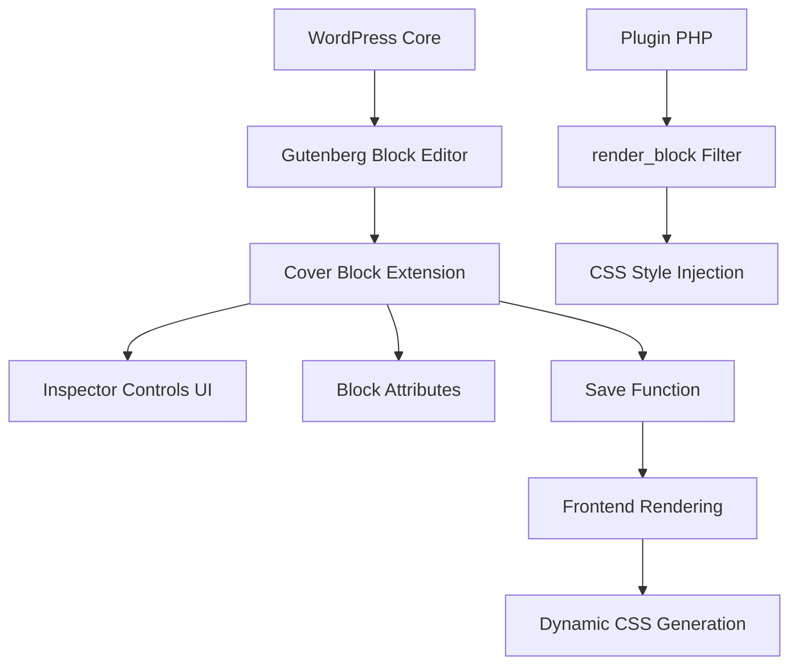

# 設計書

## 概要

Cover Responsive Focalは、WordPressのGutenbergエディタにおける標準のカバーブロックを拡張し、ブレークポイント別にフォーカルポイントを設定できる機能を提供するプラグインです。参考プラグイン「Enable Responsive Image」のアーキテクチャを参考に、カバーブロック専用の実装を行います。

## アーキテクチャ

### 全体構成



### プラグイン構造

```
cover-responsive-focal/
├── build/                     # コンパイル済みJS/CSS
├── src/
│   ├── index.tsx              # メインエントリーポイント
│   ├── inspector-controls.tsx # レスポンシブフォーカル設定UI
│   ├── types.ts               # TypeScript型定義
│   ├── constants.ts           # 定数定義
│   └── editor.scss            # エディタ用スタイル
├── cover-responsive-focal.php # プラグインメインファイル
├── package.json               # npm設定
└── readme.txt                 # WordPress.org用README
```

## コンポーネントとインターフェース

### 1. ブロック拡張システム

#### ブロック属性拡張
```typescript
interface ResponsiveFocalPoint {
  device: 'mobile' | 'tablet';           // デバイスタイプ（固定）
  x: number;                             // X座標 (0-1の範囲)
  y: number;                             // Y座標 (0-1の範囲)
}

// 既存のカバーブロック属性に追加
interface CoverBlockAttributes {
  // 既存属性（一部抜粋）
  url?: string;
  id?: number;
  focalPoint?: { x: number; y: number }; // 既存のフォーカルポイント
  hasParallax?: boolean;
  dimRatio?: number;
  overlayColor?: string;
  backgroundType?: string;
  minHeight?: number;

  // 新規追加属性（シンプル化）
  responsiveFocal: ResponsiveFocalPoint[]; // 最大2アイテム（mobile, tablet）
  dataFpId?: string; // CSS識別用の一意ID
}
```

#### フィルターフック実装
```javascript
// blocks.registerBlockType フィルターでカバーブロックを拡張
addFilter(
  'blocks.registerBlockType',
  'crf/extend-cover-block',
  (settings, name) => {
    if (name !== 'core/cover') return settings;

    // 新規属性追加
    settings.attributes.responsiveFocal = {
      type: 'array',
      default: []
    };

    settings.attributes.dataFpId = {
      type: 'string'
    };

    return settings;
  }
);
```

### 2. インスペクターコントロールUI

#### コンポーネント構成
```typescript
interface ResponsiveFocalControlsProps {
  attributes: CoverBlockAttributes;
  setAttributes: (attrs: Partial<CoverBlockAttributes>) => void;
}

const ResponsiveFocalControls: React.FC<ResponsiveFocalControlsProps> = ({
  attributes,
  setAttributes
}) => {
  // シンプルなレスポンシブフォーカルポイント設定UI
  // - モバイル用フォーカルポイントピッカー（固定）
  // - タブレット用フォーカルポイントピッカー（固定）
  // - 各デバイス用の有効/無効切り替え
};

// 固定ブレークポイント定数
const DEVICE_BREAKPOINTS = {
  mobile: { mediaQuery: '(max-width: 600px)', label: 'モバイル' },
  tablet: { mediaQuery: '(min-width: 601px) and (max-width: 1024px)', label: 'タブレット' }
} as const;

// メディアクエリ生成ヘルパー（シンプル化）
const getMediaQueryForDevice = (device: 'mobile' | 'tablet'): string => {
  return DEVICE_BREAKPOINTS[device].mediaQuery;
};
```

#### UI要素（シンプル化）
- **PanelBody**: 「レスポンシブフォーカルポイント」セクション
- **ToggleControl**: モバイル用フォーカルポイント有効/無効
- **FocalPointPicker**: モバイル用ビジュアルフォーカルポイント選択
- **ToggleControl**: タブレット用フォーカルポイント有効/無効
- **FocalPointPicker**: タブレット用ビジュアルフォーカルポイント選択
- **Text**: 各デバイスの適用範囲説明（「767px以下」「768px以上」）

### 3. 保存機能とマークアップ

#### Save関数の拡張
```javascript
// save.js での実装
const save = ({ attributes }) => {
  const { responsiveFocal, dataFpId } = attributes;

  // responsiveFocalが空の場合は標準のカバーブロック動作
  if (!responsiveFocal || responsiveFocal.length === 0) {
    return <InnerBlocks.Content />;
  }

  // data-fp-id属性を追加
  const fpId = dataFpId || `crf-${Date.now()}`;

  return (
    <div data-fp-id={fpId}>
      <InnerBlocks.Content />
    </div>
  );
};
```

### 4. サーバーサイド処理

#### render_blockフィルター
```php
function crf_render_block($content, $block) {
    if ('core/cover' !== $block['blockName']) {
        return $content;
    }

    $attrs = $block['attrs'] ?? [];
    $responsive_focal = $attrs['responsiveFocal'] ?? [];

    // 空の場合は何も処理しない（標準動作を維持）
    if (empty($responsive_focal)) {
        return $content;
    }

    $fp_id = $attrs['dataFpId'] ?? wp_unique_id('crf-');

    // data-fp-id属性をカバーブロックに追加
    $content = crf_add_fp_id_to_content($content, $fp_id);

    // CSS生成
    $css_rules = crf_generate_css_rules($responsive_focal, $fp_id);

    return $content . sprintf('<style id="%s">%s</style>',
        esc_attr($fp_id), $css_rules);
}

function crf_add_fp_id_to_content($content, $fp_id) {
    // wp-block-coverクラスを持つ要素にdata-fp-id属性を追加
    return preg_replace(
        '/(<[^>]*class="[^"]*wp-block-cover[^"]*"[^>]*)/i',
        '$1 data-fp-id="' . esc_attr($fp_id) . '"',
        $content
    );
}
```

#### CSS生成ロジック
```php
// 固定ブレークポイント定数
const CRF_DEVICE_BREAKPOINTS = [
    'mobile' => '(max-width: 600px)',
    'tablet' => '(min-width: 601px) and (max-width: 1024px)'
];

function crf_generate_css_rules($responsive_focal, $fp_id) {
    $rules = '';

    foreach ($responsive_focal as $focal_point) {
        $device = sanitize_text_field($focal_point['device']);
        $x = floatval($focal_point['x']) * 100;
        $y = floatval($focal_point['y']) * 100;

        // 固定メディアクエリを使用
        if (!isset(CRF_DEVICE_BREAKPOINTS[$device])) {
            continue; // 無効なデバイスタイプはスキップ
        }

        $media_query = CRF_DEVICE_BREAKPOINTS[$device];

        $rules .= sprintf(
            '@media %s { [data-fp-id="%s"] .wp-block-cover__image-background, [data-fp-id="%s"] .wp-block-cover__video-background { object-position: %s%% %s%%; } }',
            $media_query,
            esc_attr($fp_id),
            esc_attr($fp_id),
            $x,
            $y
        );
    }

    return $rules;
}

// バリデーション関数（シンプル化）
function crf_validate_device_type($device) {
    return in_array($device, ['mobile', 'tablet'], true);
}

// ブレークポイント検証は不要（固定値のため削除）
```

## データモデル

### 属性スキーマ（シンプル化）
```json
{
  "responsiveFocal": {
    "type": "array",
    "default": [],
    "maxItems": 2,
    "items": {
      "type": "object",
      "properties": {
        "device": {
          "type": "string",
          "enum": ["mobile", "tablet"],
          "description": "デバイスタイプ（固定）"
        },
        "x": {
          "type": "number",
          "minimum": 0,
          "maximum": 1,
          "description": "X座標（0-1）"
        },
        "y": {
          "type": "number",
          "minimum": 0,
          "maximum": 1,
          "description": "Y座標（0-1）"
        }
      }
    }
  },
  "dataFpId": {
    "type": "string",
    "description": "CSS識別用の一意ID"
  }
}
```

### デバイス設定方式（シンプル化）
```typescript
// 固定デバイス設定
const DEVICE_CONFIGS = {
  mobile: {
    label: 'モバイル',
    mediaQuery: '(max-width: 600px)',
    description: '600px以下'
  },
  tablet: {
    label: 'タブレット',
    mediaQuery: '(min-width: 601px) and (max-width: 1024px)',
    description: '601px-1024px'
  }
} as const;

// 生成されるメディアクエリ例（固定）
// device: 'mobile' → '(max-width: 600px)'
// device: 'tablet' → '(min-width: 601px) and (max-width: 1024px)'
```

## エラーハンドリング

### フロントエンド
- 無効なフォーカルポイント値の検証
- メディアクエリ構文の基本チェック
- 属性の型安全性確保

### バックエンド
- サニタイゼーション処理
- 不正な値のフィルタリング
- CSS生成時のエスケープ処理

### エラー処理パターン
```typescript
// フォーカルポイント値の検証
const validateFocalPoint = (x: number, y: number): boolean => {
  return x >= 0 && x <= 1 && y >= 0 && y <= 1;
};

// メディアクエリの基本検証
const validateMediaQuery = (media: string): boolean => {
  return media.includes('(') && media.includes(')');
};
```

## テスト戦略（TDD準拠）

### TDD開発サイクル

t-wadaのTDD（テスト駆動開発）に準拠し、以下のRed-Green-Refactorサイクルを厳密に実行します：

1. **Red**: 失敗するテストを書く
2. **Green**: テストを通す最小限のコードを書く
3. **Refactor**: コードを改善する（テストは通ったまま）

### 1. 単体テスト（Unit Tests）- TDDファースト

#### JavaScript/TypeScript テスト（テストファースト）

```typescript
// src/__tests__/validation.test.ts
// RED: まず失敗するテストを書く
describe('フォーカルポイント検証（TDD）', () => {
  // テストファースト：実装前にテストを書く
  describe('validateFocalPoint関数', () => {
    test('0.5, 0.5は有効なフォーカルポイント', () => {
      // まだ実装されていない関数をテスト（RED）
      expect(validateFocalPoint(0.5, 0.5)).toBe(true);
    });

    test('0, 0は有効なフォーカルポイント（境界値）', () => {
      expect(validateFocalPoint(0, 0)).toBe(true);
    });

    test('1, 1は有効なフォーカルポイント（境界値）', () => {
      expect(validateFocalPoint(1, 1)).toBe(true);
    });

    test('-0.1, 0.5は無効（範囲外）', () => {
      expect(validateFocalPoint(-0.1, 0.5)).toBe(false);
    });

    test('0.5, 1.1は無効（範囲外）', () => {
      expect(validateFocalPoint(0.5, 1.1)).toBe(false);
    });

    test('NaN, 0.5は無効（型不正）', () => {
      expect(validateFocalPoint(NaN, 0.5)).toBe(false);
    });

    test('undefined, 0.5は無効（型不正）', () => {
      expect(validateFocalPoint(undefined, 0.5)).toBe(false);
    });
  });

  // GREEN: テストを通す最小限の実装
  // src/validation.ts
  /*
  export const validateFocalPoint = (x: number, y: number): boolean => {
    if (typeof x !== 'number' || typeof y !== 'number') return false;
    if (isNaN(x) || isNaN(y)) return false;
    return x >= 0 && x <= 1 && y >= 0 && y <= 1;
  };
  */

  describe('validateDeviceType関数（シンプル化）', () => {
    test('mobileは有効なデバイスタイプ', () => {
      expect(validateDeviceType('mobile')).toBe(true);
    });

    test('tabletは有効なデバイスタイプ', () => {
      expect(validateDeviceType('tablet')).toBe(true);
    });

    test('無効なデバイスタイプは拒否', () => {
      expect(validateDeviceType('desktop')).toBe(false);
    });

    test('空文字は無効', () => {
      expect(validateDeviceType('')).toBe(false);
    });

    test('nullは無効', () => {
      expect(validateDeviceType(null)).toBe(false);
    });
  });

  // validateBreakpoint関数は削除（固定ブレークポイントのため不要）
});

// TDDサイクル例：ResponsiveFocalPoint型のテスト
describe('ResponsiveFocalPoint型（TDD）', () => {
  describe('createResponsiveFocalPoint関数（シンプル化）', () => {
    test('有効な値でResponsiveFocalPointオブジェクトを作成', () => {
      const result = createResponsiveFocalPoint('mobile', 0.6, 0.4);

      expect(result).toEqual({
        device: 'mobile',
        x: 0.6,
        y: 0.4
      });
    });

    test('無効なフォーカルポイントでnullを返す', () => {
      const result = createResponsiveFocalPoint('mobile', -0.1, 0.4);
      expect(result).toBeNull();
    });

    test('無効なデバイスタイプでnullを返す', () => {
      const result = createResponsiveFocalPoint('desktop', 0.6, 0.4);
      expect(result).toBeNull();
    });
  });

  describe('getMediaQueryForDevice関数（シンプル化）', () => {
    test('mobileメディアクエリを正しく生成', () => {
      const result = getMediaQueryForDevice('mobile');
      expect(result).toBe('(max-width: 600px)');
    });

    test('tabletメディアクエリを正しく生成', () => {
      const result = getMediaQueryForDevice('tablet');
      expect(result).toBe('(min-width: 601px) and (max-width: 1024px)');
    });
  });
});
```

#### PHP テスト（TDDファースト）

```php
// tests/test-css-generation.php
class CRF_CSS_Generation_Test extends WP_UnitTestCase {

    // RED: 失敗するテストから開始（シンプル化）
    public function test_generate_css_rules_single_focal_point() {
        // まだ実装されていない関数をテスト
        $responsive_focal = [
            [
                'device' => 'mobile',
                'x' => 0.6,
                'y' => 0.4
            ]
        ];

        $css = crf_generate_css_rules($responsive_focal, 'test-id');

        // 期待する出力を明確に定義
        $expected_css = '@media (max-width: 600px) { [data-fp-id="test-id"] .wp-block-cover__image-background, [data-fp-id="test-id"] .wp-block-cover__video-background { object-position: 60% 40%; } }';

        $this->assertEquals($expected_css, $css);
    }

    public function test_generate_css_rules_multiple_focal_points() {
        $responsive_focal = [
            [
                'device' => 'mobile',
                'x' => 0.6,
                'y' => 0.4
            ],
            [
                'device' => 'tablet',
                'x' => 0.3,
                'y' => 0.7
            ]
        ];

        $css = crf_generate_css_rules($responsive_focal, 'multi-test');

        $this->assertStringContains('@media (max-width: 600px)', $css);
        $this->assertStringContains('@media (min-width: 601px) and (max-width: 1024px)', $css);
        $this->assertStringContains('object-position: 60% 40%', $css);
        $this->assertStringContains('object-position: 30% 70%', $css);
    }

    public function test_generate_css_rules_empty_array() {
        $css = crf_generate_css_rules([], 'empty-test');
        $this->assertEquals('', $css);
    }

    // GREEN: 最小限の実装でテストを通す
    /*
    function crf_generate_css_rules($responsive_focal, $fp_id) {
        if (empty($responsive_focal)) {
            return '';
        }

        $rules = '';
        foreach ($responsive_focal as $focal_point) {
            $media = sanitize_text_field($focal_point['media']);
            $x = floatval($focal_point['x']) * 100;
            $y = floatval($focal_point['y']) * 100;

            $rules .= sprintf(
                '@media %s { [data-fp-id="%s"] .wp-block-cover__image-background, [data-fp-id="%s"] .wp-block-cover__video-background { object-position: %s%% %s%%; } }',
                $media, esc_attr($fp_id), esc_attr($fp_id), $x, $y
            );
        }

        return $rules;
    }
    */

    public function test_sanitize_focal_point_values() {
        $input = [
            'device' => 'mobile',
            'x' => '0.6',
            'y' => 'invalid'
        ];

        $sanitized = crf_sanitize_focal_point($input);

        $this->assertEquals('mobile', $sanitized['device']);
        $this->assertEquals(0.6, $sanitized['x']);
        $this->assertEquals(0, $sanitized['y']); // デフォルト値
    }

    public function test_validate_device_type() {
        $this->assertTrue(crf_validate_device_type('mobile'));
        $this->assertTrue(crf_validate_device_type('tablet'));
        $this->assertFalse(crf_validate_device_type('desktop'));
        $this->assertFalse(crf_validate_device_type(''));
    }

    // validateBreakpoint関数は削除（固定ブレークポイントのため不要）

    // エッジケースのテスト
    public function test_sanitize_focal_point_boundary_values() {
        $input = [
            'device' => 'tablet',
            'x' => '1.0',
            'y' => '0.0'
        ];

        $sanitized = crf_sanitize_focal_point($input);

        $this->assertEquals('tablet', $sanitized['device']);
        $this->assertEquals(1.0, $sanitized['x']);
        $this->assertEquals(0.0, $sanitized['y']);
    }
}
```

### 2. 統合テスト（Integration Tests）

#### ブロックエディタ統合テスト
```javascript
// tests/integration/block-editor.test.js
describe('カバーブロック拡張', () => {
  beforeEach(() => {
    // テスト用のブロックエディタ環境をセットアップ
    setupBlockEditor();
  });

  test('レスポンシブフォーカル属性の追加', () => {
    const block = createBlock('core/cover');
    const extendedBlock = applyFilters('blocks.registerBlockType', block, 'core/cover');

    expect(extendedBlock.attributes).toHaveProperty('responsiveFocal');
    expect(extendedBlock.attributes).toHaveProperty('dataFpId');
  });

  test('インスペクターコントロールの表示', () => {
    const { getByText, getByRole } = render(<CoverBlockEdit />);

    expect(getByText('レスポンシブフォーカルポイント')).toBeInTheDocument();
    expect(getByRole('button', { name: '新しいブレークポイントを追加' })).toBeInTheDocument();
  });
});
```

#### WordPress フィルター統合テスト
```php
// tests/integration/test-render-block.php
class CRF_Render_Block_Test extends WP_UnitTestCase {

    public function test_render_block_filter() {
        $block = [
            'blockName' => 'core/cover',
            'attrs' => [
                'responsiveFocal' => [
                    [
                        'media' => '(max-width: 767px)',
                        'x' => 0.6,
                        'y' => 0.4
                    ]
                ],
                'dataFpId' => 'test-123'
            ]
        ];

        $content = '<div class="wp-block-cover">Test Content</div>';
        $filtered_content = apply_filters('render_block', $content, $block);

        $this->assertStringContains('data-fp-id="test-123"', $filtered_content);
        $this->assertStringContains('<style id="test-123">', $filtered_content);
        $this->assertStringContains('@media (max-width: 767px)', $filtered_content);
    }
}
```

### 3. E2Eテスト（End-to-End Tests）

#### Playwright テストスイート
```typescript
// tests/e2e/cover-responsive-focal.spec.ts
import { test, expect } from '@playwright/test';

test.describe('Cover Responsive Focal E2E', () => {
  test('カバーブロックにレスポンシブフォーカルポイントを設定', async ({ page }) => {
    // WordPress管理画面にログイン
    await page.goto('/wp-admin/post-new.php');

    // カバーブロックを追加
    await page.click('[aria-label="ブロックを追加"]');
    await page.fill('[placeholder="ブロックを検索"]', 'カバー');
    await page.click('[data-type="core/cover"]');

    // 画像を設定
    await page.click('text=メディアライブラリ');
    await page.click('.attachment:first-child');
    await page.click('text=選択');

    // インスペクターでレスポンシブフォーカル設定を開く
    await page.click('[aria-label="設定"]');
    await page.click('text=レスポンシブフォーカルポイント');

    // 新しいブレークポイントを追加
    await page.click('text=新しいブレークポイントを追加');

    // メディアクエリを選択
    await page.selectOption('[data-testid="media-query-select"]', '(max-width: 767px)');

    // フォーカルポイントを設定
    await page.click('[data-testid="focal-point-picker"]', { position: { x: 100, y: 50 } });

    // 投稿を公開
    await page.click('text=公開');
    await page.click('text=公開', { nth: 1 });

    // フロントエンドで確認
    await page.click('text=投稿を表示');

    // レスポンシブCSSが適用されているか確認
    const coverBlock = page.locator('.wp-block-cover[data-fp-id]');
    await expect(coverBlock).toBeVisible();

    // モバイルビューポートでテスト
    await page.setViewportSize({ width: 375, height: 667 });

    const style = await page.locator('style[id^="crf-"]').textContent();
    expect(style).toContain('@media (max-width: 767px)');
    expect(style).toContain('object-position:');
  });

  test('複数ブレークポイントの動作確認', async ({ page }) => {
    // 複数のブレークポイントを設定するテスト
    // モバイル、タブレット、デスクトップそれぞれでフォーカルポイントを確認
  });

  test('既存カバーブロックとの互換性確認', async ({ page }) => {
    // レスポンシブフォーカル未設定のカバーブロックが正常動作するか確認
  });
});
```

#### ビジュアル回帰テスト
```typescript
// tests/e2e/visual-regression.spec.ts
test('レスポンシブフォーカルポイントのビジュアル確認', async ({ page }) => {
  const viewports = [
    { width: 375, height: 667, name: 'mobile' },
    { width: 768, height: 1024, name: 'tablet' },
    { width: 1200, height: 800, name: 'desktop' }
  ];

  for (const viewport of viewports) {
    await page.setViewportSize(viewport);
    await page.goto('/sample-cover-block-page/');

    // スクリーンショット比較
    await expect(page.locator('.wp-block-cover')).toHaveScreenshot(
      `cover-block-${viewport.name}.png`
    );
  }
});
```

### 4. パフォーマンステスト

#### CSS生成パフォーマンス
```php
// tests/performance/test-css-performance.php
class CRF_Performance_Test extends WP_UnitTestCase {

    public function test_css_generation_performance() {
        // 大量のレスポンシブフォーカルポイントでのパフォーマンステスト
        $large_responsive_focal = array_fill(0, 100, [
            'media' => '(max-width: 767px)',
            'x' => 0.5,
            'y' => 0.5
        ]);

        $start_time = microtime(true);
        $css = crf_generate_css_rules($large_responsive_focal, 'perf-test');
        $end_time = microtime(true);

        $execution_time = $end_time - $start_time;
        $this->assertLessThan(0.1, $execution_time, 'CSS生成が100ms以内で完了すること');
    }
}
```

#### フロントエンドパフォーマンス
```javascript
// tests/performance/frontend-performance.test.js
describe('フロントエンドパフォーマンス', () => {
  test('CLS（Cumulative Layout Shift）の測定', async () => {
    const page = await browser.newPage();
    await page.goto('/sample-cover-block-page/');

    const cls = await page.evaluate(() => {
      return new Promise((resolve) => {
        new PerformanceObserver((list) => {
          const entries = list.getEntries();
          const clsValue = entries.reduce((sum, entry) => sum + entry.value, 0);
          resolve(clsValue);
        }).observe({ entryTypes: ['layout-shift'] });

        setTimeout(() => resolve(0), 3000);
      });
    });

    expect(cls).toBeLessThan(0.1); // Good CLS threshold
  });
});
```

### 5. セキュリティテスト

#### XSS攻撃テスト
```php
// tests/security/test-xss-prevention.php
class CRF_Security_Test extends WP_UnitTestCase {

    public function test_xss_prevention_in_device_type() {
        $malicious_input = [
            'device' => '<script>alert("xss")</script>mobile',
            'x' => 0.5,
            'y' => 0.5
        ];

        $css = crf_generate_css_rules([$malicious_input], 'security-test');

        $this->assertStringNotContains('<script>', $css);
        $this->assertStringNotContains('alert', $css);
        $this->assertEquals('', $css); // 無効なデバイスタイプなのでCSS出力なし
    }

    public function test_invalid_device_type_prevention() {
        $malicious_input = [
            'device' => 'invalid-device-type',
            'x' => 0.5,
            'y' => 0.5
        ];

        $css = crf_generate_css_rules([$malicious_input], 'injection-test');

        $this->assertEquals('', $css); // 無効なデバイスタイプなのでCSS出力なし
    }
}
```

### 6. 互換性テスト

#### WordPress バージョン互換性
```php
// tests/compatibility/test-wp-versions.php
class CRF_Compatibility_Test extends WP_UnitTestCase {

    public function test_wordpress_6_5_compatibility() {
        // WordPress 6.5での動作確認
        $this->assertTrue(version_compare(get_bloginfo('version'), '6.5', '>='));

        // 必要なフックが存在するか確認
        $this->assertTrue(has_filter('render_block'));
        $this->assertTrue(has_filter('blocks.registerBlockType'));
    }
}
```

#### ブラウザ互換性テスト
```typescript
// tests/compatibility/browser-compatibility.spec.ts
const browsers = ['chromium', 'firefox', 'webkit'];

browsers.forEach(browserName => {
  test(`${browserName}でのobject-position対応確認`, async ({ browser }) => {
    const context = await browser.newContext();
    const page = await context.newPage();

    await page.goto('/sample-cover-block-page/');

    const objectPosition = await page.locator('.wp-block-cover__image-background')
      .evaluate(el => getComputedStyle(el).objectPosition);

    expect(objectPosition).not.toBe('initial');
  });
});
```

### 7. テスト環境とCI/CD

#### テスト環境構成
```yaml
# .github/workflows/test.yml
name: Test Suite

on: [push, pull_request]

jobs:
  unit-tests:
    runs-on: ubuntu-latest
    strategy:
      matrix:
        php-version: [7.4, 8.0, 8.1, 8.2]
        wordpress-version: [6.5, 6.6, latest]

    steps:
      - uses: actions/checkout@v3
      - name: Setup PHP
        uses: shivammathur/setup-php@v2
        with:
          php-version: ${{ matrix.php-version }}

      - name: Install WordPress Test Suite
        run: |
          bash bin/install-wp-tests.sh wordpress_test root '' localhost ${{ matrix.wordpress-version }}

      - name: Run PHPUnit
        run: phpunit

  e2e-tests:
    runs-on: ubuntu-latest
    steps:
      - uses: actions/checkout@v3
      - name: Setup Node.js
        uses: actions/setup-node@v3
        with:
          node-version: '18'

      - name: Install dependencies
        run: npm ci

      - name: Install Playwright
        run: npx playwright install

      - name: Run E2E tests
        run: npm run test:e2e
```

#### ローカルテスト環境
```json
// package.json
{
  "scripts": {
    "test": "jest",
    "test:watch": "jest --watch",
    "test:e2e": "playwright test",
    "test:e2e:ui": "playwright test --ui",
    "test:php": "phpunit",
    "test:all": "npm run test && npm run test:php && npm run test:e2e"
  }
}
```

### 8. テストデータとモック

#### テスト用データセット
```typescript
// tests/fixtures/test-data.ts
export const mockResponsiveFocalPoints = [
  {
    media: '(max-width: 767px)',
    x: 0.3,
    y: 0.7
  },
  {
    media: '(min-width: 768px) and (max-width: 1023px)',
    x: 0.6,
    y: 0.4
  },
  {
    media: '(min-width: 1024px)',
    x: 0.8,
    y: 0.2
  }
];

export const mockCoverBlockAttributes = {
  url: 'https://example.com/image.jpg',
  id: 123,
  focalPoint: { x: 0.5, y: 0.5 },
  responsiveFocal: mockResponsiveFocalPoints,
  dataFpId: 'test-fp-id'
};
```

### 9. テスト実行とレポート

#### カバレッジレポート
```javascript
// jest.config.js
module.exports = {
  collectCoverage: true,
  coverageDirectory: 'coverage',
  coverageReporters: ['text', 'lcov', 'html'],
  coverageThreshold: {
    global: {
      branches: 80,
      functions: 80,
      lines: 80,
      statements: 80
    }
  }
};
```

#### テスト結果の可視化
- Jest HTML Reporter
- Playwright HTML Report
- PHPUnit Coverage Report
- GitHub Actions テスト結果表示

### 10. 継続的テスト戦略

#### 回帰テスト
- 新機能追加時の既存機能テスト
- WordPress/Gutenbergアップデート時の互換性確認
- ブラウザアップデート時の動作確認

#### パフォーマンス監視
- フロントエンドパフォーマンス指標の継続監視
- CSS生成時間の監視
- メモリ使用量の監視

#### ユーザビリティテスト
- 実際のユーザーによる操作テスト
- アクセシビリティテスト
- 多言語環境でのテスト

## パフォーマンス考慮事項

### CSS最適化
- インラインCSS最小化
- 不要なスタイル出力の回避
- 既存のobject-positionプロパティとの互換性維持

### JavaScript最適化
- 遅延読み込み対応
- 不要な再レンダリング防止
- メモ化の活用

### レイアウトシフト対策
- object-positionのスムーズな変更
- 既存のfocalPoint属性との適切な統合
- CLS指標の最適化（既存の画像/動画要素を再利用）

## セキュリティ

### 入力値検証
- XSS攻撃対策
- CSS Injection防止
- 属性値のサニタイゼーション

### 権限管理
- 編集権限の確認
- 管理者権限での設定変更制限

## エディタープレビュー機能

### プレビュートグルボタンの設計理由

#### 技術的制約
WordPressのCoverブロックのエディター表示は、コアの実装により以下の制約があります：

1. **直接的なCSS操作の不可**
   - BlockEditコンポーネントの内部実装は変更できない
   - コアが動的に生成するCSSを外部から操作することは困難

2. **属性値の上書きによるプレビュー実現**
   - エディター上でレスポンシブフォーカルポイントをプレビューするには、`attributes.focalPoint`と`attributes.contentPosition`を一時的に上書きする必要がある
   - これは現在の技術的制約の中で最も現実的なアプローチ

#### トグルボタンの必要性

1. **元の設定値の確認**
   - プレビューをオフにすることで、コアのフォーカルポイント設定（デフォルト値）を確認できる
   - ユーザーが設定した元の値と、レスポンシブ設定の違いを比較できる

2. **デバッグとトラブルシューティング**
   - 問題が発生した場合、プレビューをオフにして原因を特定できる
   - レスポンシブ設定が意図通りに動作しているか確認できる

3. **ユーザーコントロール**
   - ユーザーが自分でプレビューのオン/オフを選択できる
   - 編集作業中に必要に応じて切り替えられる柔軟性を提供

4. **パフォーマンスへの配慮**
   - 大量のブレークポイントを設定した場合、常時プレビューだとパフォーマンスに影響する可能性
   - 必要な時だけプレビューを有効にすることで、エディターの動作を軽快に保つ

#### 実装詳細
```typescript
// プレビュー状態の管理
const [ previewFocalPoint, setPreviewFocalPoint ] = useState< { x: number; y: number } | null >( null );

// プレビューが有効な場合のみpropsを上書き
const modifiedProps = previewFocalPoint ? {
    ...props,
    attributes: {
        ...attributes,
        focalPoint: { ...previewFocalPoint },
        contentPosition: previewContentPosition
    }
} : props;
```

この設計により、技術的制約の中で最良のユーザー体験を提供しています。

## 国際化対応

### 翻訳対象文字列
- UI要素のラベル
- エラーメッセージ
- ヘルプテキスト

### 多言語サポート
- 日本語/英語対応
- RTL言語対応準備
- 文字エンコーディング対応

## 拡張性

### フィルターフック提供
```php
// デフォルトメディアクエリプリセットのカスタマイズ
apply_filters('crf_media_query_presets', $presets);

// CSS生成のカスタマイズ
apply_filters('crf_css_rules', $rules, $responsive_focal, $fp_id);

// UI表示制御
apply_filters('crf_show_inspector_controls', true);
```

### 将来の拡張計画
- 他のブロックタイプへの対応
- アニメーション効果の追加
- AI自動フォーカルポイント提案機能

## 既存カバーブロックとの統合

### 既存属性との関係
- `focalPoint`: 標準のフォーカルポイント（デフォルト値として使用）
- `url`: 背景画像URL
- `backgroundType`: "image" または "video"
- `hasParallax`: パララックス効果の有無
- `poster`: 動画のポスター画像

### フォールバック戦略
1. `responsiveFocal`が空の場合：既存の`focalPoint`を使用
2. `focalPoint`も未設定の場合：ブラウザデフォルト（center center）
3. メディアクエリが一致しない場合：既存の`focalPoint`にフォールバック

### CSS統合方針
```css
/* 基本スタイル（既存） */
.wp-block-cover__image-background,
.wp-block-cover__video-background {
  object-fit: cover;
  object-position: 50% 50%; /* デフォルト */
}

/* フォーカルポイント適用（既存） */
.wp-block-cover__image-background[style*="object-position"],
.wp-block-cover__video-background[style*="object-position"] {
  /* インラインスタイルで上書き */
}

/* レスポンシブフォーカルポイント（新規） */
@media (max-width: 767px) {
  [data-fp-id="crf-123"] .wp-block-cover__image-background,
  [data-fp-id="crf-123"] .wp-block-cover__video-background {
    object-position: 60% 40% !important;
  }
}
```
