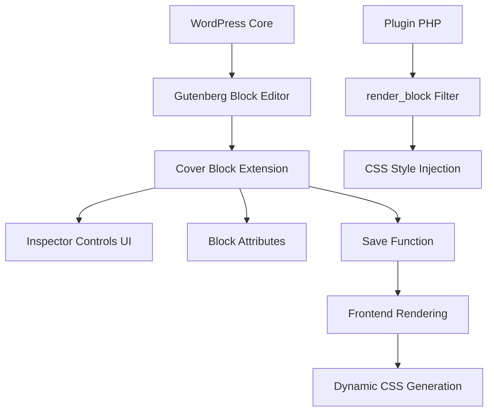

# 設計書

## 概要

Cover Responsive Focalは、WordPressのGutenbergエディタにおける標準のカバーブロックを拡張し、ブレークポイント別にフォーカルポイントを設定できる機能を提供するプラグインです。参考プラグイン「Enable Responsive Image」のアーキテクチャを参考に、カバーブロック専用の実装を行います。

### ブレークポイント仕様

本プラグインは、Gutenbergの標準ブレークポイント仕様に準拠します：

- 参照: https://github.com/WordPress/gutenberg/blob/trunk/packages/base-styles/_breakpoints.scss
- モバイル：600px以下
- タブレット：601px以上〜782px以下
- デスクトップ：783px以上（標準のfocalPoint属性を使用）

## アーキテクチャ

### 全体構成



### プラグイン構造

```
cover-responsive-focal/
├── build/                     # コンパイル済みJS/CSS
├── src/
│   ├── index.tsx              # メインエントリーポイント
│   ├── inspector-controls.tsx # レスポンシブフォーカル設定UI
│   ├── types.ts               # TypeScript型定義
│   ├── constants.ts           # 定数定義
│   ├── editor.scss            # エディタ用スタイル
│   ├── hooks/                 # カスタムフック
│   │   ├── use-device-type.ts           # WordPressエディターデバイス判定
│   │   └── use-device-state-management.ts  # デバイス状態管理
│   ├── components/            # UIコンポーネント
│   │   ├── device-focal-point-control.tsx  # デバイス別フォーカルポイント設定UI
│   │   └── safe-stack-layout.tsx           # 安全なレイアウトコンポーネント
│   ├── utils/                 # ユーティリティ関数
│   │   ├── css-generator.ts   # CSS生成ユーティリティ
│   │   ├── editor-styles.ts   # エディター用スタイル生成
│   │   ├── environment.ts     # 環境判定ユーティリティ
│   │   └── index.ts           # ユーティリティエクスポート
│   └── validation/            # バリデーション関数
│       ├── factory.ts         # バリデーション関数ファクトリー
│       ├── media-query.ts     # メディアクエリ検証
│       └── validators.ts      # 基本バリデーター
├── tests/                     # テストファイル
│   └── __tests__/
│       ├── css-generator.test.ts        # CSS生成テスト
│       ├── editor-styles.test.ts        # エディタースタイルテスト
│       ├── validation.test.ts           # バリデーションテスト
│       └── use-device-state-management.test.ts  # 状態管理テスト
├── cover-responsive-focal.php # プラグインメインファイル
├── package.json               # npm設定
└── readme.txt                 # WordPress.org用README
```

## コンポーネントとインターフェース

### 1. ブロック拡張システム

#### ブロック属性拡張

```typescript
interface ResponsiveFocalPoint {
	device: "mobile" | "tablet"; // デバイスタイプ（固定）
	x: number; // X座標 (0-1の範囲)
	y: number; // Y座標 (0-1の範囲)
}

// 既存のカバーブロック属性に追加
interface CoverBlockAttributes {
	// 既存属性（一部抜粋）
	url?: string;
	id?: number;
	focalPoint?: { x: number; y: number }; // 既存のフォーカルポイント
	hasParallax?: boolean;
	dimRatio?: number;
	overlayColor?: string;
	backgroundType?: string;
	minHeight?: number;

	// 新規追加属性（シンプル化）
	responsiveFocal: ResponsiveFocalPoint[]; // 最大2アイテム（mobile, tablet）
	dataFpId?: string; // CSS識別用の一意ID
}
```

#### フィルターフック実装

```javascript
// blocks.registerBlockType フィルターでカバーブロックを拡張
addFilter(
	"blocks.registerBlockType",
	"crf/extend-cover-block",
	(settings, name) => {
		if (name !== "core/cover") return settings;

		// 新規属性追加
		settings.attributes.responsiveFocal = {
			type: "array",
			default: [],
		};

		settings.attributes.dataFpId = {
			type: "string",
		};

		return settings;
	},
);
```

### 2. ユーティリティ関数群

#### CSS生成ユーティリティ (`src/utils/css-generator.ts`)

```typescript
// CSS object-position値の生成
export const generateObjectPosition = (x: number, y: number): string => {
  const xPercent = Math.round(x * 100);
  const yPercent = Math.round(y * 100);
  return `${xPercent}% ${yPercent}%`;
};

// CSS セレクター生成
export const generateFocalPointSelector = (fpId: string): string => {
  return `[data-fp-id="${fpId}"] .wp-block-cover__image-background, [data-fp-id="${fpId}"] .wp-block-cover__video-background`;
};

// 完全なレスポンシブCSS生成
export const generateResponsiveFocalCSS = (
  responsiveFocalPoints: ResponsiveFocalPoint[],
  fpId: string
): string => {
  // メディアクエリとobject-positionを組み合わせたCSS生成
  // 例: @media (max-width: 600px) { [data-fp-id="crf-123"] .wp-block-cover__image-background { object-position: 60% 40% !important; } }
};

// バリデーション機能
export const validateResponsiveFocalPoint = (focal: ResponsiveFocalPoint): boolean;
export const sanitizeResponsiveFocalPoints = (points: ResponsiveFocalPoint[]): ResponsiveFocalPoint[];
```

#### エディタースタイル生成 (`src/utils/editor-styles.ts`)

```typescript
// デバイスタイプに応じたフォーカルポイント取得
export const getFocalPointForDevice = (
  responsiveFocal: ResponsiveFocalPoint[],
  deviceType: string // 'Desktop' | 'Tablet' | 'Mobile'
): FocalPointCSS | null => {
  // WordPress エディターのデバイスタイプを internal device type にマップ
  const deviceMapping = {
    'Mobile': 'mobile',
    'Tablet': 'tablet',
    'Desktop': null // デスクトップは常にコアのfocalPointを使用
  };
};

// エディタープレビュー用CSS生成
export const generateEditorPreviewCSS = (
  responsiveFocal: ResponsiveFocalPoint[],
  deviceType: string,
  blockId: string
): string | null => {
  // ブロック固有のCSS生成（エディター内での一時的プレビュー用）
  // 例: [data-block="client-id"] .wp-block-cover__image-background { object-position: 60% 40% !important; }
};

// レスポンシブフォーカル適用判定
export const shouldApplyResponsiveFocal = (
  responsiveFocal: ResponsiveFocalPoint[],
  deviceType: string
): boolean;
```

#### デバイス判定フック (`src/hooks/use-device-type.ts`)

```typescript
// WordPressエディターのデバイスプレビューモード取得
export const useDeviceType = (): string => {
	return useSelect((select) => {
		// WordPress 6.x以降の新しいセレクター
		const editor = select("core/editor");
		if (editor?.getDeviceType) {
			return editor.getDeviceType();
		}

		// フォールバック（古いバージョン対応）
		const editPost = select("core/edit-post");
		if (editPost?.__experimentalGetPreviewDeviceType) {
			return editPost.__experimentalGetPreviewDeviceType();
		}

		return "Desktop"; // デフォルト値
	}, []);
};

// 実効ビューポート幅の取得
export const useEffectiveViewportWidth = (): number => {
	// デバイスタイプに応じた仮想ビューポート幅を返す
	// Mobile: 360px, Tablet: 768px, Desktop: 実際のwindow.innerWidth
};
```

### 3. インスペクターコントロールUI

#### コンポーネント構成

```typescript
interface ResponsiveFocalControlsProps {
	attributes: CoverBlockAttributes;
	setAttributes: (attrs: Partial<CoverBlockAttributes>) => void;
}

const ResponsiveFocalControls: React.FC<ResponsiveFocalControlsProps> = ({
	attributes,
	setAttributes,
}) => {
	// シンプルなレスポンシブフォーカルポイント設定UI
	// - モバイル用フォーカルポイントピッカー（固定）
	// - タブレット用フォーカルポイントピッカー（固定）
	// - 各デバイス用の有効/無効切り替え
};

// 固定ブレークポイント定数（Gutenberg標準に準拠）
const DEVICE_BREAKPOINTS = {
	mobile: { mediaQuery: "(max-width: 600px)", label: "モバイル" },
	tablet: {
		mediaQuery: "(min-width: 601px) and (max-width: 782px)",
		label: "タブレット",
	},
} as const;

// メディアクエリ生成ヘルパー（シンプル化）
const getMediaQueryForDevice = (device: "mobile" | "tablet"): string => {
	return DEVICE_BREAKPOINTS[device].mediaQuery;
};
```

#### UI要素（シンプル化）

- **PanelBody**: 「レスポンシブフォーカルポイント」セクション
- **ToggleControl**: モバイル用フォーカルポイント有効/無効
- **FocalPointPicker**: モバイル用ビジュアルフォーカルポイント選択
- **ToggleControl**: タブレット用フォーカルポイント有効/無効
- **FocalPointPicker**: タブレット用ビジュアルフォーカルポイント選択
- **Text**: 各デバイスの適用範囲説明（「600px以下」「601px-782px」）

### 3. 保存機能とマークアップ

#### Save関数の拡張

```javascript
// save.js での実装
const save = ({ attributes }) => {
	const { responsiveFocal, dataFpId } = attributes;

	// responsiveFocalが空の場合は標準のカバーブロック動作
	if (!responsiveFocal || responsiveFocal.length === 0) {
		return <InnerBlocks.Content />;
	}

	// data-fp-id属性を追加
	const fpId = dataFpId || `crf-${Date.now()}`;

	return (
		<div data-fp-id={fpId}>
			<InnerBlocks.Content />
		</div>
	);
};
```

### 4. サーバーサイド処理

#### render_blockフィルター

```php
function crf_render_block($content, $block) {
    if ('core/cover' !== $block['blockName']) {
        return $content;
    }

    $attrs = $block['attrs'] ?? [];
    $responsive_focal = $attrs['responsiveFocal'] ?? [];

    // 空の場合は何も処理しない（標準動作を維持）
    if (empty($responsive_focal)) {
        return $content;
    }

    $fp_id = $attrs['dataFpId'] ?? wp_unique_id('crf-');

    // data-fp-id属性をカバーブロックに追加
    $content = crf_add_fp_id_to_content($content, $fp_id);

    // CSS生成
    $css_rules = crf_generate_css_rules($responsive_focal, $fp_id);

    return $content . sprintf('<style id="%s">%s</style>',
        esc_attr($fp_id), $css_rules);
}

function crf_add_fp_id_to_content($content, $fp_id) {
    // wp-block-coverクラスを持つ要素にdata-fp-id属性を追加
    return preg_replace(
        '/(<[^>]*class="[^"]*wp-block-cover[^"]*"[^>]*)/i',
        '$1 data-fp-id="' . esc_attr($fp_id) . '"',
        $content
    );
}
```

#### CSS生成ロジック

```php
// 固定ブレークポイント定数（Gutenberg標準に準拠）
const CRF_DEVICE_BREAKPOINTS = [
    'mobile' => '(max-width: 600px)',
    'tablet' => '(min-width: 601px) and (max-width: 782px)'
];

function crf_generate_css_rules($responsive_focal, $fp_id) {
    $rules = '';

    foreach ($responsive_focal as $focal_point) {
        $device = sanitize_text_field($focal_point['device']);
        $x = floatval($focal_point['x']) * 100;
        $y = floatval($focal_point['y']) * 100;

        // 固定メディアクエリを使用
        if (!isset(CRF_DEVICE_BREAKPOINTS[$device])) {
            continue; // 無効なデバイスタイプはスキップ
        }

        $media_query = CRF_DEVICE_BREAKPOINTS[$device];

        $rules .= sprintf(
            '@media %s { [data-fp-id="%s"] .wp-block-cover__image-background, [data-fp-id="%s"] .wp-block-cover__video-background { object-position: %s%% %s%% !important; } }',
            $media_query,
            esc_attr($fp_id),
            esc_attr($fp_id),
            $x,
            $y
        );
    }

    return $rules;
}

// 期待される出力例（Issue #37対応）：
// <style id="crf-123">@media (max-width: 600px) { [data-fp-id="crf-123"] .wp-block-cover__image-background, [data-fp-id="crf-123"] .wp-block-cover__video-background { object-position: 60% 40% !important; } }@media (min-width: 601px) and (max-width: 782px) { [data-fp-id="crf-123"] .wp-block-cover__image-background, [data-fp-id="crf-123"] .wp-block-cover__video-background { object-position: 30% 70% !important; } }</style>

// バリデーション関数（シンプル化）
function crf_validate_device_type($device) {
    return in_array($device, ['mobile', 'tablet'], true);
}

// ブレークポイント検証は不要（固定値のため削除）
```

## データモデル

### 属性スキーマ（シンプル化）

```json
{
	"responsiveFocal": {
		"type": "array",
		"default": [],
		"maxItems": 2,
		"items": {
			"type": "object",
			"properties": {
				"device": {
					"type": "string",
					"enum": ["mobile", "tablet"],
					"description": "デバイスタイプ（固定）"
				},
				"x": {
					"type": "number",
					"minimum": 0,
					"maximum": 1,
					"description": "X座標（0-1）"
				},
				"y": {
					"type": "number",
					"minimum": 0,
					"maximum": 1,
					"description": "Y座標（0-1）"
				}
			}
		}
	},
	"dataFpId": {
		"type": "string",
		"description": "CSS識別用の一意ID"
	}
}
```

### デバイス設定方式（シンプル化）

```typescript
// 固定デバイス設定（Gutenberg標準に準拠）
const DEVICE_CONFIGS = {
	mobile: {
		label: "モバイル",
		mediaQuery: "(max-width: 600px)",
		description: "600px以下",
	},
	tablet: {
		label: "タブレット",
		mediaQuery: "(min-width: 601px) and (max-width: 782px)",
		description: "601px-782px",
	},
} as const;

// 生成されるメディアクエリ例（固定）
// device: 'mobile' → '(max-width: 600px)'
// device: 'tablet' → '(min-width: 601px) and (max-width: 782px)'
```

## エラーハンドリング

### フロントエンド

- 無効なフォーカルポイント値の検証
- メディアクエリ構文の基本チェック
- 属性の型安全性確保

### バックエンド

- サニタイゼーション処理
- 不正な値のフィルタリング
- CSS生成時のエスケープ処理

### エラー処理パターン

```typescript
// フォーカルポイント値の検証
const validateFocalPoint = (x: number, y: number): boolean => {
	return x >= 0 && x <= 1 && y >= 0 && y <= 1;
};

// メディアクエリの基本検証
const validateMediaQuery = (media: string): boolean => {
	return media.includes("(") && media.includes(")");
};
```

## テスト戦略（新方針準拠）

### テスト方針の概要

docs/test-pre-prd.mdで定義された新しいテスト戦略に基づき、以下のテストピラミッド構造を採用します：

```text
┌─────────────────┐
│   E2E Tests     │ ← 20% (Critical paths only)
├─────────────────┤
│ Integration     │ ← 30% (Save function, attribute parsing)
├─────────────────┤
│   Unit Tests    │ ← 50% (Independent components)
└─────────────────┘
```

### 1. 単体テスト（Unit Tests）- WordPress独立コンポーネント

#### JavaScript/TypeScript 単体テスト（WordPress独立）

##### CSS生成ユーティリティテスト (`tests/__tests__/css-generator.test.ts`)

現在実装済みのテストを拡張し、WordPress APIに依存しない純粋な関数をテスト：

```typescript
describe("CSS Generator", () => {
	describe("generateObjectPosition", () => {
		test("generates correct percentage values", () => {
			expect(generateObjectPosition(0.5, 0.5)).toBe("50% 50%");
			expect(generateObjectPosition(0, 0)).toBe("0% 0%");
			expect(generateObjectPosition(1, 1)).toBe("100% 100%");
		});

		test("rounds decimal values correctly", () => {
			expect(generateObjectPosition(0.335, 0.666)).toBe("34% 67%");
		});
	});

	// 新規追加予定のテスト
	describe("generateResponsiveFocalCSS", () => {
		test("generates CSS for multiple focal points", () => {
			const focals: ResponsiveFocalPoint[] = [
				{ device: "mobile", x: 0.6, y: 0.4 },
				{ device: "tablet", x: 0.3, y: 0.7 },
			];

			const result = generateResponsiveFocalCSS(focals, "multi-test");
			expect(result).toContain("@media (max-width: 600px)");
			expect(result).toContain(
				"@media (min-width: 601px) and (max-width: 782px)",
			);
			expect(result).toContain("object-position: 60% 40% !important");
			expect(result).toContain("object-position: 30% 70% !important");
		});
	});
});
```

##### エディタースタイルテスト (`tests/__tests__/editor-styles.test.ts`)

現在実装済みのテストを継続し、WordPress独立のユーティリティ関数をテスト：

```typescript
describe("Editor Styles", () => {
	const mockResponsiveFocal: ResponsiveFocalPoint[] = [
		{ device: "mobile", x: 0.6, y: 0.4 },
		{ device: "tablet", x: 0.3, y: 0.7 },
	];

	describe("getFocalPointForDevice", () => {
		test("returns correct focal point for mobile device", () => {
			const result = getFocalPointForDevice(mockResponsiveFocal, "Mobile");
			expect(result).toEqual({ x: 0.6, y: 0.4 });
		});

		test("returns null for desktop device", () => {
			const result = getFocalPointForDevice(mockResponsiveFocal, "Desktop");
			expect(result).toBeNull();
		});
	});

	// WordPress独立のユーティリティ関数のテストを継続
	describe("generateEditorPreviewCSS", () => {
		test("generates CSS for mobile device", () => {
			const result = generateEditorPreviewCSS(
				mockResponsiveFocal,
				"Mobile",
				"test-block-id",
			);

			expect(result).toContain('[data-block="test-block-id"]');
			expect(result).toContain(".wp-block-cover__image-background");
			expect(result).toContain("object-position: 60% 40% !important");
		});
	});
});
```

##### バリデーションテスト（継続・拡張）

現在実装済みの`tests/__tests__/validation.test.ts`を継続し、WordPress独立の検証ロジックをテスト：

```typescript
// tests/__tests__/validation.test.ts（現在実装済み）
describe("フォーカルポイント検証", () => {
	describe("validateFocalPoint関数", () => {
		test("0.5, 0.5は有効なフォーカルポイント", () => {
			expect(validateFocalPoint(0.5, 0.5)).toBe(true);
		});

		test("境界値テスト", () => {
			expect(validateFocalPoint(0, 0)).toBe(true);
			expect(validateFocalPoint(1, 1)).toBe(true);
		});

		test("範囲外値の拒否", () => {
			expect(validateFocalPoint(-0.1, 0.5)).toBe(false);
			expect(validateFocalPoint(0.5, 1.1)).toBe(false);
		});

		test("不正な型の拒否", () => {
			expect(validateFocalPoint(NaN, 0.5)).toBe(false);
			expect(validateFocalPoint(undefined, 0.5)).toBe(false);
		});
	});

	describe("validateDeviceType関数（シンプル化）", () => {
		test("mobileは有効なデバイスタイプ", () => {
			expect(validateDeviceType("mobile")).toBe(true);
		});

		test("tabletは有効なデバイスタイプ", () => {
			expect(validateDeviceType("tablet")).toBe(true);
		});

		test("無効なデバイスタイプは拒否", () => {
			expect(validateDeviceType("desktop")).toBe(false);
		});
	});

	describe("createResponsiveFocalPoint関数", () => {
		test("有効な値でResponsiveFocalPointオブジェクトを作成", () => {
			const result = createResponsiveFocalPoint("mobile", 0.6, 0.4);
			expect(result).toEqual({
				device: "mobile",
				x: 0.6,
				y: 0.4,
			});
		});

		test("無効な値でnullを返す", () => {
			const result = createResponsiveFocalPoint("mobile", -0.1, 0.4);
			expect(result).toBeNull();
		});
	});
});
```

#### PHP 単体テスト（WordPress独立ロジック）

現在実装済みの`tests/php/CRF_CSS_Generation_Test.php`を継続し、WordPress独立のPHPロジックをテスト：

```php
// tests/php/CRF_CSS_Generation_Test.php（現在実装済み）
class CRF_CSS_Generation_Test extends TestCase {

    public function test_generate_css_rules_single_focal_point() {
        $responsive_focal = [
            [
                'device' => 'mobile',
                'x' => 0.6,
                'y' => 0.4
            ]
        ];

        $css = $this->css_optimizer->generate_css_rules($responsive_focal, 'test-id');

        $expected_css = '@media (max-width: 600px) { [data-fp-id="test-id"] .wp-block-cover__image-background, [data-fp-id="test-id"] .wp-block-cover__video-background { object-position: 60% 40% !important; } }';

        $this->assertEquals($expected_css, $css);
    }

    public function test_generate_css_rules_multiple_focal_points() {
        $responsive_focal = [
            [
                'device' => 'mobile',
                'x' => 0.6,
                'y' => 0.4
            ],
            [
                'device' => 'tablet',
                'x' => 0.3,
                'y' => 0.7
            ]
        ];

        $css = $this->css_optimizer->generate_css_rules($responsive_focal, 'multi-test');

        $this->assertStringContainsString('@media (max-width: 600px)', $css);
        $this->assertStringContainsString('@media (min-width: 601px) and (max-width: 782px)', $css);
        $this->assertStringContainsString('object-position: 60% 40%', $css);
        $this->assertStringContainsString('object-position: 30% 70%', $css);
    }

    public function test_validate_device_type() {
        $this->assertTrue($this->validator->validate_device_type('mobile'));
        $this->assertTrue($this->validator->validate_device_type('tablet'));
        $this->assertFalse($this->validator->validate_device_type('desktop'));
        $this->assertFalse($this->validator->validate_device_type(''));
    }
}
```

### 2. 統合テスト（Integration Tests）- Save関数・属性解析

#### ブロック保存機能テスト（スナップショットテスト）

```javascript
// tests/__tests__/block-save-simple.test.ts（現在実装済み）
describe("Block Save Output", () => {
	it("should generate correct markup", () => {
		const attributes = {
			responsiveFocal: [{ device: "mobile", x: 0.6, y: 0.4 }],
			dataFpId: "test-123",
		};
		const output = save({ attributes });
		expect(output).toMatchSnapshot();
	});

	it("should maintain backward compatibility with empty responsiveFocal", () => {
		const attributes = { responsiveFocal: [] };
		const output = save({ attributes });
		expect(output).toMatchSnapshot();
	});
});
```

#### ブロック属性解析テスト

```javascript
// tests/__tests__/block-attributes.test.ts（現在実装済み）
describe("Block Attributes", () => {
	test("parses responsiveFocal attribute correctly", () => {
		const blockContent =
			'<!-- wp:core/cover {"responsiveFocal":[{"device":"mobile","x":0.6,"y":0.4}]} -->';
		const parsed = parseBlockAttributes(blockContent);

		expect(parsed.responsiveFocal).toHaveLength(1);
		expect(parsed.responsiveFocal[0]).toEqual({
			device: "mobile",
			x: 0.6,
			y: 0.4,
		});
	});
});
```

#### WordPress フィルター統合テスト

```php
// tests/php/CRF_Render_Block_Test.php（現在実装済み）
class CRF_Render_Block_Test extends TestCase {

    public function test_render_block_filter() {
        $block = [
            'blockName' => 'core/cover',
            'attrs' => [
                'responsiveFocal' => [
                    [
                        'device' => 'mobile',
                        'x' => 0.6,
                        'y' => 0.4
                    ]
                ],
                'dataFpId' => 'test-123'
            ]
        ];

        $content = '<div class="wp-block-cover">Test Content</div>';
        $filtered_content = apply_filters('render_block', $content, $block);

        $this->assertStringContainsString('data-fp-id="test-123"', $filtered_content);
        $this->assertStringContainsString('<style id="test-123">', $filtered_content);
        $this->assertStringContainsString('@media (max-width: 600px)', $filtered_content);
    }
}
```

### 3. E2Eテスト（End-to-End Tests）- クリティカルパスのみ

#### 重要な操作フローのテスト（20%）

現在実装済みの`tests/e2e/specs/cover-block-basic.spec.ts`を基に、クリティカルパスに絞ったテストを実行：

```typescript
// tests/e2e/specs/cover-block-basic.spec.ts（現在実装済み）
test.describe("Cover Block - Basic Responsive Focal Point Functionality", () => {
	test("Verify plugin loads correctly", async ({ page }) => {
		await coverBlock.selectCoverBlock();

		const pluginScript = await page.evaluate(() => {
			return Array.from(document.scripts).some((script) =>
				script.src.includes("cover-responsive-focal"),
			);
		});

		expect(pluginScript).toBeTruthy();
	});

	test("Responsive focal point settings are displayed in cover block", async ({
		page,
	}) => {
		await wpAdmin.insertCoverBlock();
		await coverBlock.addMediaToCover(TEST_IMAGES.LANDSCAPE);
		await coverBlock.openResponsiveFocalSettings();

		await expect(
			page.locator(SELECTORS.RESPONSIVE_FOCAL_CONTROLS),
		).toBeVisible();
	});

	test("Can configure responsive focal point", async ({ page }) => {
		await wpAdmin.insertCoverBlock();
		await coverBlock.addMediaToCover(TEST_IMAGES.LANDSCAPE);
		await coverBlock.openResponsiveFocalSettings();

		await coverBlock.addNewBreakpoint();

		const testFocalPoint = TEST_FOCAL_POINTS.BASIC_RESPONSIVE[0];
		await coverBlock.setResponsiveFocalPoint(0, testFocalPoint);

		// 設定が正しく反映されているか確認
		const firstRow = page.locator(SELECTORS.RESPONSIVE_FOCAL_ROW).first();
		const mediaTypeSelect = firstRow.locator("select");
		await expect(mediaTypeSelect).toHaveValue(testFocalPoint.mediaType);
	});
});
```

#### フロントエンド表示確認テスト

```typescript
// tests/e2e/specs/frontend-display.spec.ts（現在実装済み）
test.describe("Frontend Display Tests", () => {
	test("Responsive focal points apply correctly on frontend", async ({
		page,
	}) => {
		// 投稿を表示してレスポンシブCSSが適用されているか確認
		await page.goto("/sample-cover-block-page/");

		const coverBlock = page.locator(".wp-block-cover[data-fp-id]");
		await expect(coverBlock).toBeVisible();

		// モバイルビューポートでテスト
		await page.setViewportSize({ width: 375, height: 667 });

		const style = await page.locator('style[id^="crf-"]').textContent();
		expect(style).toContain("@media (max-width: 600px)");
		expect(style).toContain("object-position:");
	});
});
```

#### ビジュアル回帰テスト（最小限）

```typescript
// tests/e2e/specs/visual-regression.spec.ts（現在実装済み）
test("Visual regression test for responsive focal points", async ({ page }) => {
	const viewports = [
		{ width: 375, height: 667, name: "mobile" },
		{ width: 768, height: 1024, name: "tablet" },
		{ width: 1200, height: 800, name: "desktop" },
	];

	for (const viewport of viewports) {
		await page.setViewportSize(viewport);
		await page.goto("/sample-cover-block-page/");

		await expect(page.locator(".wp-block-cover")).toHaveScreenshot(
			`cover-block-${viewport.name}.png`,
		);
	}
});
```

### 4. パフォーマンステスト（要件準拠）

#### CSS生成パフォーマンス

現在実装済みの`tests/php/CRF_CSS_Optimization_Test.php`を継続：

```php
// tests/php/CRF_CSS_Optimization_Test.php（現在実装済み）
class CRF_CSS_Optimization_Test extends TestCase {

    public function test_css_generation_performance() {
        // 大量のレスポンシブフォーカルポイントでのパフォーマンステスト
        $large_responsive_focal = array_fill(0, 100, [
            'device' => 'mobile',
            'x' => 0.5,
            'y' => 0.5
        ]);

        $start_time = microtime(true);
        $css = $this->css_optimizer->generate_css_rules($large_responsive_focal, 'perf-test');
        $end_time = microtime(true);

        $execution_time = $end_time - $start_time;
        $this->assertLessThan(0.1, $execution_time, 'CSS生成が100ms以内で完了すること');
    }

    public function test_css_minification() {
        $responsive_focal = [
            ['device' => 'mobile', 'x' => 0.6, 'y' => 0.4],
            ['device' => 'tablet', 'x' => 0.3, 'y' => 0.7]
        ];

        $css = $this->css_optimizer->generate_css_rules($responsive_focal, 'minify-test');

        // 不要な空白が除去されているか確認
        $this->assertStringNotContainsString('  ', $css);
        $this->assertStringNotContainsString("\n", $css);
    }
}
```

#### フロントエンドパフォーマンス（要件4.3, 4.4準拠）

```javascript
// tests/e2e/specs/frontend-rendering.spec.ts（現在実装済み）
test.describe("Frontend Performance Tests", () => {
	test("CLS (Cumulative Layout Shift) measurement", async ({ page }) => {
		await page.goto("/sample-cover-block-page/");

		const cls = await page.evaluate(() => {
			return new Promise((resolve) => {
				new PerformanceObserver((list) => {
					const entries = list.getEntries();
					const clsValue = entries.reduce((sum, entry) => sum + entry.value, 0);
					resolve(clsValue);
				}).observe({ entryTypes: ["layout-shift"] });

				setTimeout(() => resolve(0), 3000);
			});
		});

		// 要件4.3: CLSが0.1以下
		expect(cls).toBeLessThan(0.1);
	});

	test("LCP (Largest Contentful Paint) measurement", async ({ page }) => {
		await page.goto("/sample-cover-block-page/");

		const lcp = await page.evaluate(() => {
			return new Promise((resolve) => {
				new PerformanceObserver((list) => {
					const entries = list.getEntries();
					const lastEntry = entries[entries.length - 1];
					resolve(lastEntry.startTime);
				}).observe({ entryTypes: ["largest-contentful-paint"] });

				setTimeout(() => resolve(5000), 5000);
			});
		});

		// 要件4.4: LCPが2.5秒未満
		expect(lcp).toBeLessThan(2500);
	});
});
```

### 5. セキュリティテスト

#### XSS攻撃防止テスト

現在実装済みの`tests/php/CRF_Sanitization_Test.php`を継続：

```php
// tests/php/CRF_Sanitization_Test.php（現在実装済み）
class CRF_Sanitization_Test extends TestCase {

    public function test_xss_prevention_in_device_type() {
        $malicious_input = [
            'device' => '<script>alert("xss")</script>mobile',
            'x' => 0.5,
            'y' => 0.5
        ];

        $css = $this->css_optimizer->generate_css_rules([$malicious_input], 'security-test');

        $this->assertStringNotContainsString('<script>', $css);
        $this->assertStringNotContainsString('alert', $css);
        $this->assertEquals('', $css); // 無効なデバイスタイプなのでCSS出力なし
    }

    public function test_invalid_device_type_prevention() {
        $malicious_input = [
            'device' => 'invalid-device-type',
            'x' => 0.5,
            'y' => 0.5
        ];

        $css = $this->css_optimizer->generate_css_rules([$malicious_input], 'injection-test');

        $this->assertEquals('', $css); // 無効なデバイスタイプなのでCSS出力なし
    }

    public function test_css_escaping() {
        $responsive_focal = [
            [
                'device' => 'mobile',
                'x' => 0.5,
                'y' => 0.5
            ]
        ];

        // 特殊文字を含むIDでテスト
        $malicious_id = 'test"id<script>';
        $css = $this->css_optimizer->generate_css_rules($responsive_focal, $malicious_id);

        // HTMLエスケープが適用されているか確認
        $this->assertStringNotContainsString('<script>', $css);
        $this->assertStringNotContainsString('"id<', $css);
    }
}
```

### 6. 互換性テスト（要件3準拠）

#### WordPress バージョン互換性

```php
// tests/php/CRF_Compatibility_Test.php（新規追加予定）
class CRF_Compatibility_Test extends TestCase {

    public function test_wordpress_6_5_compatibility() {
        // 要件3.3: WordPress 6.5以上での動作確認
        $this->assertTrue(version_compare(get_bloginfo('version'), '6.5', '>='));

        // 必要なフックが存在するか確認
        $this->assertTrue(has_filter('render_block'));
        $this->assertTrue(has_filter('blocks.registerBlockType'));
    }

    public function test_backward_compatibility_empty_responsive_focal() {
        // 要件3.1: responsiveFocal配列が空の時の標準動作
        $block = [
            'blockName' => 'core/cover',
            'attrs' => [
                'responsiveFocal' => [],
                'url' => 'test-image.jpg',
                'focalPoint' => ['x' => 0.5, 'y' => 0.5]
            ]
        ];

        $content = '<div class="wp-block-cover">Test Content</div>';
        $filtered_content = apply_filters('render_block', $content, $block);

        // 追加のスタイルやマークアップが出力されないことを確認
        $this->assertEquals($content, $filtered_content);
    }
}
```

#### ブラウザ互換性テスト

```typescript
// tests/e2e/specs/plugin-integration.spec.ts（現在実装済み）
test.describe("Browser Compatibility Tests", () => {
	const browsers = ["chromium", "firefox", "webkit"];

	browsers.forEach((browserName) => {
		test(`${browserName} object-position support verification`, async ({
			page,
		}) => {
			await page.goto("/sample-cover-block-page/");

			const objectPosition = await page
				.locator(".wp-block-cover__image-background")
				.evaluate((el) => getComputedStyle(el).objectPosition);

			expect(objectPosition).not.toBe("initial");
		});
	});
});
```

### 7. テスト実行戦略（新方針準拠）

#### 優先順位付け

新しいテスト方針に基づく実行優先順位：

1. **クリティカルパスE2E**: メインユーザー操作フロー
2. **保存スナップショット**: データ整合性保証
3. **コンポーネント単体**: ビジネスロジック検証
4. **フルE2E**: 包括的動作検証

#### 実行タイミング

- **PR時**: クリティカルパスE2E + スナップショット + 単体テスト
- **メインブランチマージ時**: 全テスト
- **リリース前**: フルE2E回帰テスト

#### CI/CD環境構成

```yaml
# .github/workflows/test.yml（新方針対応）
name: Test Suite (New Strategy)

on: [push, pull_request]

jobs:
  unit-tests:
    runs-on: ubuntu-latest
    strategy:
      matrix:
        php-version: [7.4, 8.0, 8.1, 8.2]
        wordpress-version: [6.5, 6.6, latest]

    steps:
      - uses: actions/checkout@v3
      - name: Setup PHP
        uses: shivammathur/setup-php@v2
        with:
          php-version: ${{ matrix.php-version }}

      - name: Run Unit Tests (50%)
        run: |
          npm test -- --testPathPattern="__tests__"
          phpunit --testsuite=unit

  integration-tests:
    runs-on: ubuntu-latest
    steps:
      - uses: actions/checkout@v3
      - name: Run Integration Tests (30%)
        run: |
          npm test -- --testPathPattern="integration"
          phpunit --testsuite=integration

  critical-e2e:
    runs-on: ubuntu-latest
    if: github.event_name == 'pull_request'
    steps:
      - uses: actions/checkout@v3
      - name: Run Critical Path E2E (20%)
        run: |
          npx playwright test --grep="@critical"

  full-e2e:
    runs-on: ubuntu-latest
    if: github.ref == 'refs/heads/main'
    steps:
      - uses: actions/checkout@v3
      - name: Run Full E2E Suite
        run: |
          npx playwright test
```

## Issue #37 対応事項

### 変更内容

1. **ブレークポイント仕様の修正**

   - タブレット範囲を `601px-1024px` から `601px-782px` に変更
   - Gutenbergの標準ブレークポイント仕様に準拠
   - 参照: https://github.com/WordPress/gutenberg/blob/trunk/packages/base-styles/_breakpoints.scss

2. **CSS出力形式の修正**

   - `!important` 宣言を明示的に追加
   - 既存のカバーブロックスタイルを確実に上書きするため
   - 出力例: `object-position: 60% 40% !important;`

3. **デスクトップ範囲の調整**
   - デスクトップを `1025px以上` から `783px以上` に変更
   - タブレット上限に合わせて調整

### 影響範囲

- 要件定義書の受け入れ基準
- 設計ドキュメントの定数定義
- テストコードの期待値
- フロントエンド出力仕様ame: Run E2E tests
  run: npm run test:e2e

````

#### ローカルテスト環境
```json
// package.json
{
  "scripts": {
    "test": "jest",
    "test:watch": "jest --watch",
    "test:e2e": "playwright test",
    "test:e2e:ui": "playwright test --ui",
    "test:php": "phpunit",
    "test:all": "npm run test && npm run test:php && npm run test:e2e"
  }
}
````

### 8. テストデータとモック

#### テスト用データセット

```typescript
// tests/fixtures/test-data.ts
export const mockResponsiveFocalPoints = [
	{
		media: "(max-width: 767px)",
		x: 0.3,
		y: 0.7,
	},
	{
		media: "(min-width: 768px) and (max-width: 1023px)",
		x: 0.6,
		y: 0.4,
	},
	{
		media: "(min-width: 783px)",
		x: 0.8,
		y: 0.2,
	},
];

export const mockCoverBlockAttributes = {
	url: "https://example.com/image.jpg",
	id: 123,
	focalPoint: { x: 0.5, y: 0.5 },
	responsiveFocal: mockResponsiveFocalPoints,
	dataFpId: "test-fp-id",
};
```

### 9. テスト実行とレポート

#### カバレッジレポート

```javascript
// jest.config.js
module.exports = {
	collectCoverage: true,
	coverageDirectory: "coverage",
	coverageReporters: ["text", "lcov", "html"],
	coverageThreshold: {
		global: {
			branches: 80,
			functions: 80,
			lines: 80,
			statements: 80,
		},
	},
};
```

#### テスト結果の可視化

- Jest HTML Reporter
- Playwright HTML Report
- PHPUnit Coverage Report
- GitHub Actions テスト結果表示

### 10. 継続的テスト戦略

#### 回帰テスト

- 新機能追加時の既存機能テスト
- WordPress/Gutenbergアップデート時の互換性確認
- ブラウザアップデート時の動作確認

#### パフォーマンス監視

- フロントエンドパフォーマンス指標の継続監視
- CSS生成時間の監視
- メモリ使用量の監視

#### ユーザビリティテスト

- 実際のユーザーによる操作テスト
- アクセシビリティテスト
- 多言語環境でのテスト

## パフォーマンス考慮事項

### CSS最適化

- インラインCSS最小化
- 不要なスタイル出力の回避
- 既存のobject-positionプロパティとの互換性維持

### JavaScript最適化

- 遅延読み込み対応
- 不要な再レンダリング防止
- メモ化の活用

### レイアウトシフト対策

- object-positionのスムーズな変更
- 既存のfocalPoint属性との適切な統合
- CLS指標の最適化（既存の画像/動画要素を再利用）

## セキュリティ

### 入力値検証

- XSS攻撃対策
- CSS Injection防止
- 属性値のサニタイゼーション

### 権限管理

- 編集権限の確認
- 管理者権限での設定変更制限

## エディタープレビュー機能

### リアルタイムプレビューシステム

#### 設計方針

WordPressエディターのデバイスプレビューモードと連動したリアルタイムプレビューシステムを実装しています：

1. **WordPressエディターとの統合**

   - エディター標準のデバイスプレビューボタン（Desktop/Tablet/Mobile）と完全連動
   - `useDeviceType()` フックでリアルタイムにデバイス状態を監視
   - ユーザーが慣れ親しんだWordPress UIを活用

2. **!important CSS による上書き方式**
   - コアのスタイルを変更せず、外部CSSで上書き
   - `object-position: X% Y% !important` でコアスタイルより高い優先度を確保
   - エディター内に動的にstyle要素を注入・削除

#### 技術実装詳細

##### デバイス判定とCSS生成

```typescript
// デバイスタイプの監視
const deviceType = useDeviceType(); // 'Desktop' | 'Tablet' | 'Mobile'

// CSS生成とDOM注入
useEffect(() => {
	const css = generateEditorPreviewCSS(responsiveFocal, deviceType, clientId);

	if (css) {
		const styleElement = document.createElement("style");
		styleElement.id = `crf-preview-${clientId}`;
		styleElement.textContent = css;
		document.head.appendChild(styleElement);
	}

	// クリーンアップ
	return () => {
		const element = document.getElementById(`crf-preview-${clientId}`);
		if (element) element.remove();
	};
}, [responsiveFocal, deviceType, clientId]);
```

##### CSS生成ロジック

```typescript
// エディター用CSS生成
export const generateEditorPreviewCSS = (
	responsiveFocal: ResponsiveFocalPoint[],
	deviceType: string,
	blockId: string,
): string | null => {
	// デバイスタイプに応じたフォーカルポイント取得
	const focalPoint = getFocalPointForDevice(responsiveFocal, deviceType);

	if (!focalPoint) return null;

	const objectPosition = generateObjectPosition(focalPoint);

	// ブロック固有のCSS生成
	return `
        [data-block="${blockId}"] .wp-block-cover__image-background,
        [data-block="${blockId}"] .wp-block-cover__video-background {
            object-position: ${objectPosition} !important;
        }
    `;
};
```

#### プレビュー動作仕様

1. **デバイス切り替え時の動作**

   - **Desktop選択時**: レスポンシブフォーカルは無効、コアのfocalPointを表示
   - **Tablet選択時**: タブレット用フォーカルポイントが設定されていれば適用
   - **Mobile選択時**: モバイル用フォーカルポイントが設定されていれば適用

2. **視覚的インジケーター**

   ```typescript
   // レスポンシブフォーカルが有効な場合の表示
   {isResponsiveFocalActive && (
       <div style={{
           position: 'absolute',
           top: '8px',
           right: '8px',
           backgroundColor: 'rgba(0, 0, 0, 0.7)',
           color: 'white',
           padding: '4px 8px',
           borderRadius: '4px',
           fontSize: '12px'
       }}>
           Responsive Focal: {deviceType}
       </div>
   )}
   ```

3. **パフォーマンス最適化**
   - ブロック単位でのstyle要素管理（コンポーネントアンマウント時に自動削除）
   - デバイスタイプとフォーカルポイント変更時のみCSS再生成
   - 不要なレンダリングを防ぐためのメモ化

#### ユーザー体験の向上

1. **直感的な操作**

   - 既存のWordPressエディターUIを活用
   - 追加の学習コストなし
   - リアルタイムでの即座な反映

2. **明確な状態表示**

   - 現在適用中のデバイスタイプを視覚的に表示
   - レスポンシブフォーカル有効/無効の明確な区別

3. **エラー耐性**
   - 不正なフォーカルポイント値の場合は自動的にフォールバック
   - クライアントIDが取得できない場合の安全な処理

この設計により、ユーザーはWordPressの標準的な操作でレスポンシブフォーカルポイントをリアルタイムに確認でき、技術的制約を感じることなく直感的に利用できます。

## 国際化対応

### 翻訳対象文字列

- UI要素のラベル
- エラーメッセージ
- ヘルプテキスト

### 多言語サポート

- 日本語/英語対応
- RTL言語対応準備
- 文字エンコーディング対応

## 拡張性

### フィルターフック提供

```php
// デフォルトメディアクエリプリセットのカスタマイズ
apply_filters('crf_media_query_presets', $presets);

// CSS生成のカスタマイズ
apply_filters('crf_css_rules', $rules, $responsive_focal, $fp_id);

// UI表示制御
apply_filters('crf_show_inspector_controls', true);
```

### 将来の拡張計画

- 他のブロックタイプへの対応
- アニメーション効果の追加
- AI自動フォーカルポイント提案機能

## 既存カバーブロックとの統合

### 既存属性との関係

- `focalPoint`: 標準のフォーカルポイント（デフォルト値として使用）
- `url`: 背景画像URL
- `backgroundType`: "image" または "video"
- `hasParallax`: パララックス効果の有無
- `poster`: 動画のポスター画像

### フォールバック戦略

1. `responsiveFocal`が空の場合：既存の`focalPoint`を使用
2. `focalPoint`も未設定の場合：ブラウザデフォルト（center center）
3. メディアクエリが一致しない場合：既存の`focalPoint`にフォールバック

### CSS統合方針

```css
/* 基本スタイル（既存） */
.wp-block-cover__image-background,
.wp-block-cover__video-background {
	object-fit: cover;
	object-position: 50% 50%; /* デフォルト */
}

/* フォーカルポイント適用（既存） */
.wp-block-cover__image-background[style*="object-position"],
.wp-block-cover__video-background[style*="object-position"] {
	/* インラインスタイルで上書き */
}

/* レスポンシブフォーカルポイント（新規） */
@media (max-width: 767px) {
	[data-fp-id="crf-123"] .wp-block-cover__image-background,
	[data-fp-id="crf-123"] .wp-block-cover__video-background {
		object-position: 60% 40% !important;
	}
}
```
